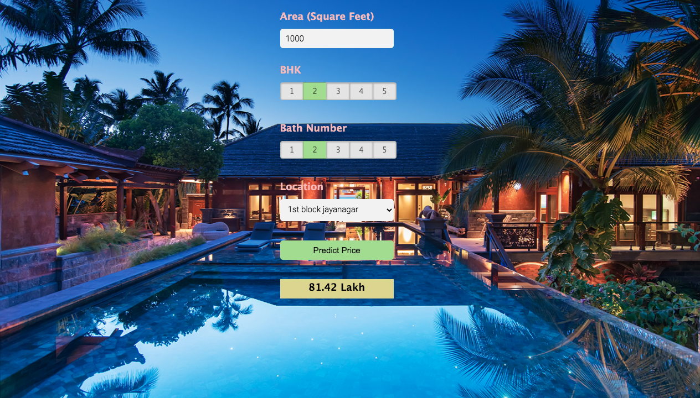

# Real Estate Price Prediction



- This GitHub project provides a comprehensive guide on building a real estate price prediction website. The project takes you through a step-by-step process, starting from building a machine learning model using scikit-learn and linear regression. The dataset used for training the model is the Bangalore home prices dataset obtained from Kaggle.com.

- The first step involves constructing the model using scikit-learn and linear regression, utilizing the features from the Bangalore home prices dataset. The model is trained to predict real estate prices based on factors such as square footage, number of bedrooms, and other relevant attributes.

- The second step focuses on developing a Python Flask server that serves HTTP requests using the trained model. The Flask server acts as the backend for the website and handles the prediction requests from users.

- The third component of the project is the website itself, which is built using HTML, CSS, and JavaScript. The website provides a user-friendly interface where users can input the square footage, number of bedrooms, and other property details. The website then communicates with the Python Flask server to retrieve the predicted price based on the provided information.

- Throughout the project, various crucial concepts in data science are covered. This includes data loading and cleaning, outlier detection and removal, feature engineering, dimensionality reduction, hyperparameter tuning using GridSearchCV, and k-fold cross-validation.

- From a technology and tool perspective, this project covers a range of technologies commonly used in data science and web development. It involves Python programming for building the machine learning model and the Flask server, HTML/CSS/JavaScript for the website's frontend, and libraries such as scikit-learn for machine learning tasks.

- By following this project, users can gain a comprehensive understanding of the end-to-end process involved in building a real estate price prediction website. They will learn essential data science concepts and gain hands-on experience with popular tools and technologies commonly used in the field.

1. Python
2. Numpy and Pandas for data cleaning
3. Matplotlib for data visualization
4. Sklearn for model building
5. Jupyter notebook, visual studio code and pycharm as IDE
6. Python flask for http server
7. HTML/CSS/Javascript for UI

# Deploy this app to cloud (AWS EC2)

1. Create EC2 instance using amazon console, also in security group add a rule to allow HTTP incoming traffic
2. Now connect to your instance using a command like this,
```
ssh -i "C:\Users\Viral\.ssh\Banglore.pem" ubuntu@ec2-3-133-88-210.us-east-2.compute.amazonaws.com
```
3. nginx setup
   1. Install nginx on EC2 instance using these commands,
   ```
   sudo apt-get update
   sudo apt-get install nginx
   ```
   2. Above will install nginx as well as run it. Check status of nginx using
   ```
   sudo service nginx status
   ```
   3. Here are the commands to start/stop/restart nginx
   ```
   sudo service nginx start
   sudo service nginx stop
   sudo service nginx restart
   ```
   4. Now when you load cloud url in browser you will see a message saying "welcome to nginx" This means your nginx is setup and running.
4. Now you need to copy all your code to EC2 instance. You can do this either using git or copy files using winscp. We will use winscp. You can download winscp from here: https://winscp.net/eng/download.php
5. Once you connect to EC2 instance from winscp (instruction in a youtube video), you can now copy all code files into /home/ubuntu/ folder. The full path of your root folder is now: **/home/ubuntu/BangloreHomePrices**
6.  After copying code on EC2 server now we can point nginx to load our property website by default. For below steps,
    1. Create this file /etc/nginx/sites-available/bhp.conf. The file content looks like this,
    ```
    server {
	    listen 80;
            server_name bhp;
            root /home/ubuntu/HomePricePrediction/client;
            index app.html;
            location /api/ {
                 rewrite ^/api(.*) $1 break;
                 proxy_pass http://127.0.0.1:5000;
            }
    }
    ```
    2. Create symlink for this file in /etc/nginx/sites-enabled by running this command,
    ```
    sudo ln -v -s /etc/nginx/sites-available/bhp.conf
    ```
    3. Remove symlink for default file in /etc/nginx/sites-enabled directory,
    ```
    sudo unlink default
    ```
    4. Restart nginx,
    ```
    sudo service nginx restart
    ```
7. Now install python packages and start flask server
```
sudo apt-get install python3-pip
sudo pip3 install -r /home/ubuntu/BangloreHomePrices/server/requirements.txt
python3 /home/ubuntu/BangloreHomePrices/client/server.py
```
Running last command above will prompt that server is running on port 5000.
8. Now just load your cloud url in browser (for me it was http://ec2-44-203-179-47.compute-1.amazonaws.com/) and this will be fully functional website running in production cloud environment


